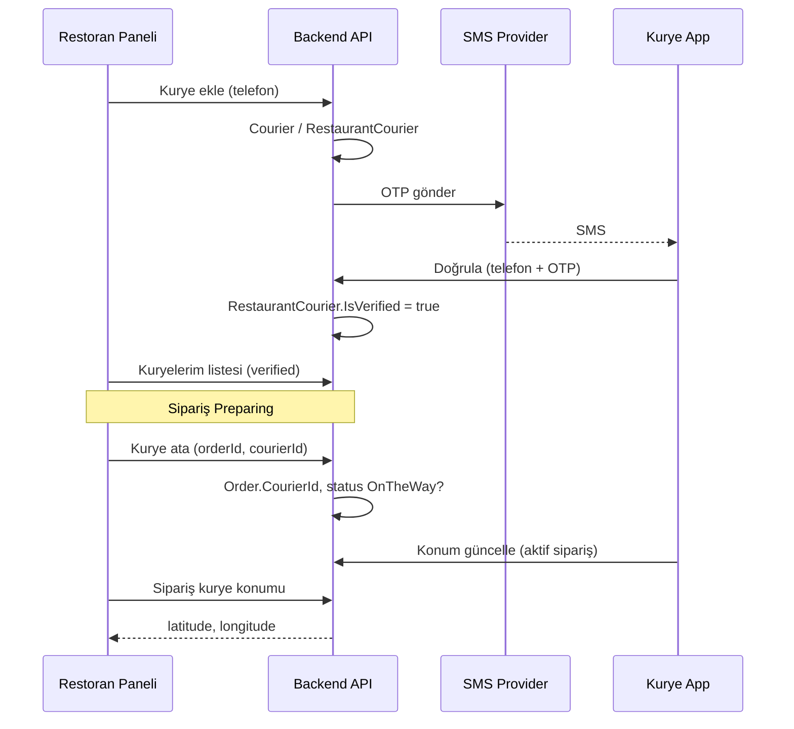

# Kurye Modülü Geliştirme Planı

## Mevcut durum özeti

- **Backend:** .NET 8, Clean Architecture; sipariş akışı `Order` entity ve `OrderManager` ile; statüler `Preparing` → `OnTheWay` → `Delivered`. Kurye/driver entity yok.
- **Restoran paneli:** [front-seller](front-seller/) (Next.js), Sidebar’da Dashboard, Restoranlarım, Siparişler, Abonelik, Kuponlar. Siparişler [SellerOrderController](backend/WebAPI/Controllers/Seller/SellerOrderController.cs) ile listeleniyor ve statü güncelleniyor.
- **Müşteri uygulaması:** [front-app](front-app/) (React Native), sadece müşteri.
- **Auth:** Şu an email + şifre; SMS/OTP altyapısı yok. Roller: Admin, User, SellerAdmin, SellerUser (Courier yok).
- **Konum:** [Restaurant](backend/Domain/Entities/Seller/Restaurant.cs) ve [Address](backend/Domain/Entities/Common/Address.cs) için `Latitude`/`Longitude` mevcut; mesafe hesaplanabilir.

---

## 1. Domain ve veri modeli

### Yeni entity’ler

| Entity                     | Açıklama                                                                                                                                                                                                    |
| -------------------------- | ----------------------------------------------------------------------------------------------------------------------------------------------------------------------------------------------------------- |
| **Courier**                | `Id`, `Phone` (unique), `FirstName`, `LastName` (opsiyonel), `CreatedDate`. Kurye hesabı; platform kurye hizmeti vermiyor ama kurye “sisteme üye” (telefon ile tanımlanıyor).                               |
| **RestaurantCourier**      | `RestaurantId`, `CourierId`, `Phone` (eklendiği numara), `IsVerified`, `VerifiedAt`, `CreatedDate`. Restoran–kurye eşleşmesi; doğrulama sonrası `IsVerified = true`.                                        |
| **CourierVerificationOtp** | `Id`, `Phone`, `Code`, `ExpiresAt`, `CreatedAt`. SMS ile giden OTP; doğrulama sonrası silinebilir veya expire.                                                                                              |
| **CourierLocation**        | `Id`, `CourierId`, `OrderId` (opsiyonel, hangi sipariş için), `Latitude`, `Longitude`, `UpdatedAt`. Konum güncellemeleri; restoran sadece “bu restorana ait sipariş + atanmış kurye” için son konumu görür. |

### Mevcut entity güncellemeleri

- **Order:** `CourierId` (nullable Guid), isteğe bağlı `DeliveryDistanceKm` (decimal?) — restoran–teslimat adresi mesafesi; kurye atanınca veya sipariş oluşurken hesaplanıp saklanabilir.

### Rol tercihi

- **Seçenek A (önerilen):** Kurye için ayrı **Courier** entity; giriş **sadece telefon + OTP**. Token’da `CourierId` taşınır; `User` tablosuna bağlamak zorunlu değil.
- **Seçenek B:** `User` tablosuna `UserRoleEnums.Courier` eklenir; kurye email/şifre veya telefon+OTP ile giriş yapar. Daha sonra “tek hesap” isterseniz B’ye geçilebilir.

Plan, **Seçenek A** üzerine (telefon + OTP, ayrı Courier entity) yazılmıştır.

### Mesafe

- Siparişte: `Order.RestaurantId` → Restaurant.Lat/Lng, `Order.DeliveryAddressId` → Address.Lat/Lng. Haversine (veya DB spatial) ile mesafe hesaplanır; `Order.DeliveryDistanceKm` olarak saklanabilir veya her istekte hesaplanır. Kurye tarafında sadece bu mesafe gösterilir, sipariş içeriği gösterilmez.

---

## 2. Backend iş akışları ve API’ler

### 2.1 SMS altyapısı

- Projede şu an **SMS/OTP yok**. Türkiye için NetGSM, Ileti Merkezi veya Twilio kullanılabilir.
- **Yapı:** `Infrastructure` içinde `ISmsSender` (SendAsync(phone, message)) ve bir implementasyon (örn. NetGSM). OTP üretimi (6 haneli), `CourierVerificationOtp` kaydı ve süre kontrolü (örn. 5 dk) application katmanında.
- Config: `appsettings` / env ile SMS provider key ve gönderici bilgisi.

### 2.2 Restoran → Kurye ekleme ve doğrulama

1. Restoran panelden “Kurye ekle” ile **telefon numarası** girer (fiziksel anlaştığı kurye).
2. **POST** `/v1/seller/restaurant/{restaurantId}/courier/invite` body: `{ "phone": "+90..." }`
  - Yetki: SellerAdmin/SellerUser, restoranın kendi restoranı olmalı.
  - `Courier` yoksa oluştur (telefon ile); `RestaurantCourier` oluştur (`IsVerified = false`).
  - OTP üret, `CourierVerificationOtp` kaydet, SMS gönder.
3. Doğrulama: **POST** `/v1/courier/verify` (public veya restoran tarafından tetiklenebilir) body: `{ "phone": "...", "code": "123456" }`
  - OTP eşleşir ve süresi geçmemişse ilgili `RestaurantCourier.IsVerified = true`, `VerifiedAt = now`, OTP kaydı silinir/inaktif edilir.
4. Restoran “Kuryelerim” listesi: **GET** `/v1/seller/restaurant/{restaurantId}/couriers` → sadece `IsVerified = true` olanlar (veya hepsi, UI’da “Doğrulanmamış” etiketi).
5. İsteğe bağlı: **DELETE** `/v1/seller/restaurant/{restaurantId}/couriers/{courierId}` — restoran kuryeyi listeden çıkarır.

### 2.3 Siparişe kurye atama

- Sipariş durumu **Preparing** iken restoran, kendi doğrulanmış kuryelerinden birini atayabilir.
- **PUT** `/v1/seller/order/{orderId}/assign-courier` body: `{ "courierId": "guid" }`
  - Yetki: SellerAdmin/SellerUser, sipariş bu restoranın olmalı.
  - Kontrol: `courierId`, bu restoranın `RestaurantCourier` listesinde ve `IsVerified = true` olmalı.
  - `Order.CourierId = courierId` set edilir. İsteğe bağlı: aynı anda statü **OnTheWay** yapılabilir veya ayrı bir “Yola çıktı” butonu ile `UpdateOrderStatus(orderId, OnTheWay)` çağrılır.
- Mevcut [SellerOrderController](backend/WebAPI/Controllers/Seller/SellerOrderController.cs) ve [OrderManager.UpdateOrderStatus](backend/Application/Services/Buyer/OrderService/OrderManager.cs) genişletilir veya yeni endpoint’ler eklenir.

### 2.4 Kurye konum takibi (restoran)

- Restoran, **sadece kendi restoranına ait** ve **atanmış kuryesi olan** sipariş için (örn. statü OnTheWay/Delivered) kurye konumunu görsün.
- **GET** `/v1/seller/order/{orderId}/courier-location`
  - Sipariş.RestaurantId = token’daki restoran, Order.CourierId not null.
  - Son `CourierLocation` kaydı (OrderId = orderId veya CourierId, en son UpdatedAt) döner: `{ latitude, longitude, updatedAt }`.
- Konum verisi: kurye uygulaması periyodik olarak backend’e gönderir (aşağıda).

### 2.5 Kurye uygulaması auth ve API’ler

- **POST** `/v1/courier/auth/send-otp` body: `{ "phone": "..." }`  
  - Telefon sistemde bir `RestaurantCourier` kaydında varsa (en az bir restoran tarafından eklenmişse) OTP üretilir, SMS gider, `CourierVerificationOtp` kaydedilir.
- **POST** `/v1/courier/auth/login` body: `{ "phone": "...", "code": "..." }`  
  - OTP doğru ve geçerliyse: CourierId ile **courier token** üretilir (mevcut token yapısına CourierId eklenebilir veya ayrı bir JWT/encrypted payload). Response: token + courier bilgisi.
- **GET** `/v1/courier/orders/active`  
  - Bu kuryenin atandığı, statüsü OnTheWay (ve isteğe bağlı Preparing) siparişler. Dönüşte: sipariş içeriği **yok**; restoran adı, teslimat adresi özeti, **mesafe (km)**, sipariş id, status.
- **GET** `/v1/courier/orders/history?month=2025-03&year=2025`  
  - Aylık geçmiş; yine sipariş içeriği yok, mesafe ve özet bilgiler.
- **POST** `/v1/courier/location` body: `{ "latitude": 41.0, "longitude": 29.0, "orderId": "optional" }`  
  - Sadece aktif (OnTheWay) siparişi varsa anlamlı; `CourierLocation` güncellenir. Rate limit (örn. 10 sn’de bir) önerilir.

### 2.6 Mesafe hesaplama

- `Order` için: Restaurant (Lat/Lng) ve Delivery Address (Lat/Lng) ile Haversine (veya MySQL spatial) hesaplanır.
- Değer ya sipariş oluşurken/atanırken `Order.DeliveryDistanceKm` alanına yazılır ya da courier/order API’lerinde anlık hesaplanır. Kurye tarafında sadece bu alan (ve birim) gösterilir.

---

## 3. Backend teknik adımlar (kısa)

- **Domain:** Courier, RestaurantCourier, CourierVerificationOtp, CourierLocation entity’leri; Order’a `CourierId` (ve isteğe bağlı `DeliveryDistanceKm`).
- **Persistence:** EF Configuration, DbSet, migration; gerekli repository’ler ve UnitOfWork.
- **Application:** CourierService (invite, verify, list, assign), CourierAuthService (send-otp, login), OrderManager’da AssignCourier ve mesafe hesaplama; location update endpoint’i için küçük bir service.
- **Infrastructure:** `ISmsSender` + NetGSM (veya seçilen provider) adapter.
- **WebAPI:** Yeni controller’lar veya mevcut controller’lara action’lar: Seller courier invite/list/delete, assign-courier, courier-location; Courier auth (send-otp, login), orders/active, orders/history, location. Auth filter’da “Courier” token tipi (CourierId) tanınmalı.
- **TokenDto / Client:** Courier girişinde `UserId` yerine/ek olarak `CourierId` taşınacak şekilde genişletme (mevcut [TokenDto](backend/Base/Entities/TokenDto.cs) ve [Client](backend/Base/Constant/Client.cs) yapısına uyumlu).

---

## 4. Restoran paneli (front-seller)

- **Sidebar:** “Kuryelerim” linki (örn. `/restaurants/[id]/couriers` veya genel `/couriers` ve restoran seçimi).
- **Kuryelerim sayfası:**  
  - Listeleme: Bu restoranın doğrulanmış (ve isteğe bağlı doğrulanmamış) kuryeleri.  
  - “Yeni ekle”: Telefon input → invite API → “SMS gönderildi” mesajı.  
  - Doğrulama: Kurye kendi telefonuna gelen kodu girecek; bunu ya kurye uygulamasında yapıp “hesabımı doğrula” akışıyla yapar ya da restoran tarafında “Doğrulama bekleniyor – kurye kodunu girmeli” bilgisi gösterilir. (Doğrulama tek yerde: courier verify endpoint.)
- **Siparişler / Sipariş detay:**  
  - Sipariş **Preparing** iken “Kurye Ata” butonu; modal’da bu restoranın doğrulanmış kurye listesi; seçim → assign-courier API.  
  - Sipariş **OnTheWay** ve kurye atanmışsa: “Kurye konumu” alanı; GET courier-location ile harita veya metin (enlem/boylam + son güncelleme zamanı).
- **API client:** [front-seller/lib/api.js](front-seller/lib/api.js) ile yeni endpoint’ler için fonksiyonlar (couriers list, invite, order assign-courier, courier-location).

---

## 5. Kurye mobil uygulaması (front-courier)

- **Teknoloji:** Mevcut [front-app](front-app/) ile aynı stack (React Native) önerilir; yeni proje **front-courier** (veya `apps/courier`) olarak.
- **Auth:** Giriş ekranı → telefon numarası → “Kod gönder” → send-otp → kod girişi → login → token (CourierId) saklanır.
- **Ekranlar:**  
  - **Aktif siparişler:** Bu kuryenin atandığı, henüz teslim edilmemiş siparişler; her satırda restoran adı, teslimat bölgesi özeti, **mesafe (km)**; sipariş içeriği gösterilmez.  
  - **Geçmiş:** Aylık seçim (ay/yıl); liste aynı formatta (mesafe, restoran, tarih).  
  - **Konum:** Arka planda (sadece aktif sipariş varken) periyodik olarak konum gönderimi (POST `/v1/courier/location`). İzin ve arka plan konum politikası (privacy) belirlenmeli.
- **Navigasyon:** Auth stack (login) + Ana stack (Aktif, Geçmiş, Profil/Çıkış).

---

## 6. Akış özeti (mermaid)

---

## 7. Dosya ve klasör önerileri

| Bölüm           | Konum                                                                                                                                                                                      |
| --------------- | ------------------------------------------------------------------------------------------------------------------------------------------------------------------------------------------ |
| Entity’ler      | `backend/Domain/Entities/Courier/` (Courier.cs, RestaurantCourier.cs, CourierVerificationOtp.cs, CourierLocation.cs)                                                                       |
| DTO’lar         | `backend/Domain/Dto/Seller/Courier/`, `backend/Domain/Dto/Courier/`                                                                                                                        |
| Courier service | `backend/Application/Services/Seller/CourierService/` (invite, list), `backend/Application/Services/Courier/` (auth, orders, location)                                                     |
| SMS             | `backend/Infrastructure/Sms/` veya mevcut Adapters altında `SmsAdapter/`                                                                                                                   |
| Controller’lar  | `backend/WebAPI/Controllers/Seller/SellerCourierController.cs`, `backend/WebAPI/Controllers/Courier/CourierAuthController.cs`, `CourierOrderController.cs`, `CourierLocationController.cs` |
| Restoran UI     | `front-seller/app/couriers/` veya `front-seller/app/restaurants/[id]/couriers/`                                                                                                            |
| Kurye app       | Yeni repo/klasör: `front-courier/` (React Native)                                                                                                                                          |

---

## 8. Todo klasörü ve plan dokümanı

- Proje ana dizininde `**todo**` klasörü şu an yok. **Plan onaylandıktan sonra** bu planın özeti `todo/kurye-modulu.md` dosyasına yazılacak; böylece referans doküman tek yerde toplanmış olur.
- İsterseniz uygulama adımlarını da todo maddeleri olarak aynı MD içinde listeleyebiliriz (Backend domain, migration, SMS, API, front-seller, front-courier).

---

## 9. Belirsizlikler / Kararlar

- **SMS provider:** NetGSM / Ileti Merkezi / Twilio seçimi (maliyet ve Türkiye kapsamı).
- **Kurye “müsaitlik”:** MVP’de sadece “doğrulanmış kurye listesinden ata”; ileride kurye uygulamasında “Müsaitim / Müsait değilim” toggle eklenebilir.
- **Konum sıklığı ve gizlilik:** Arka planda konum ne sıklıkla gönderilecek (örn. 10–30 sn), sadece “aktif sipariş” varken mi; kullanım koşulları ve uygulama mağaza açıklamaları buna göre yazılmalı.

Bu plan, mevcut sipariş ve restoran akışını bozmadan kurye modülünü eklemek için yeterli detayı içerir. Onay sonrası ilk adım olarak domain entity’leri ve migration, ardından SMS ve seller courier API’leri ile devam edilebilir; sonrasında front-seller “Kuryelerim” ve siparişe atama, en sonda kurye uygulaması geliştirilebilir.